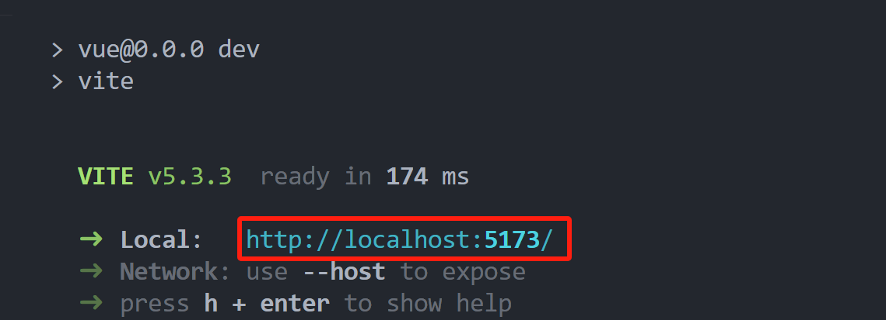
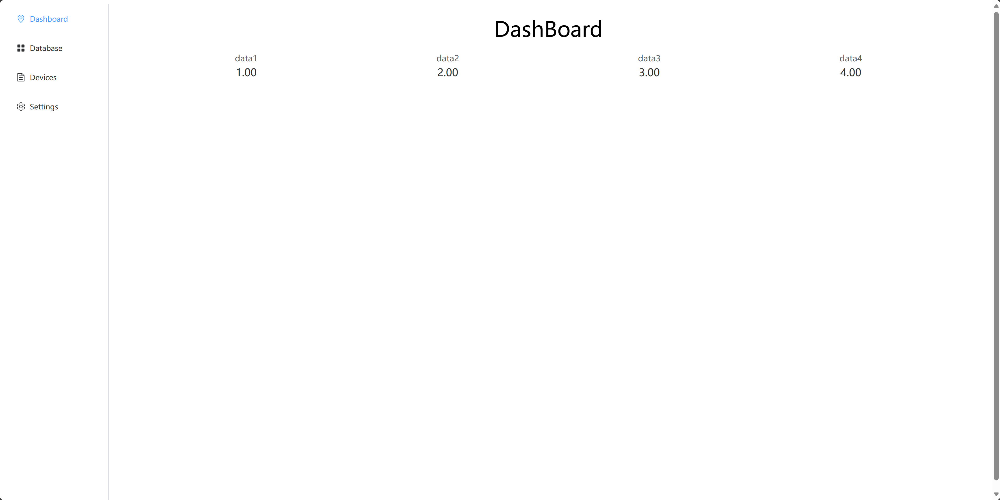

# Flask + Vue 前后端分离架构

## 启动 Flask

运行 `./main.py`

PS 端口很重要，因为没有使用 DNS 服务器，所以不能随意修改，是前端向后端发送请求的关键

## 启动 Vue

若未完成环境配置，请先安装 `Node.JS` 

然后按照 `./vue/README.md` 中的步骤安装依赖

若已完成环境配置

进入 `vue` 执行指令 `npm run dev`

## 进入前端页面

即可看到如下测试内容

可以尝试使用左边栏进行路由